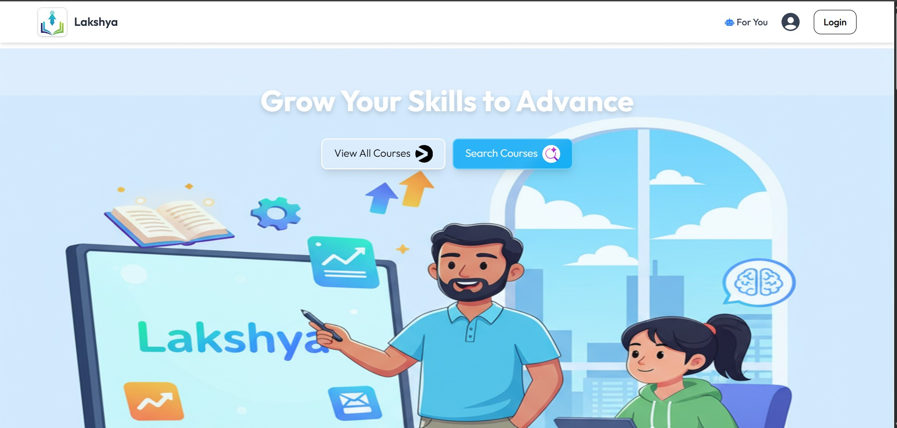
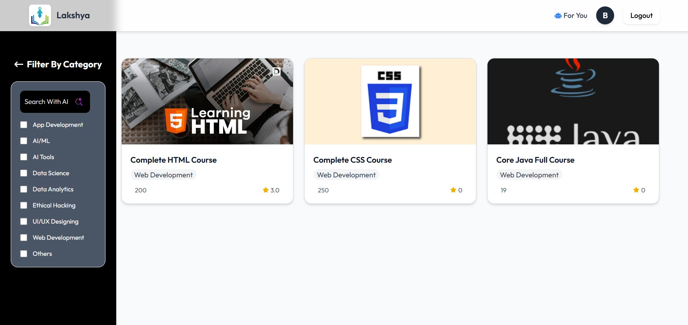
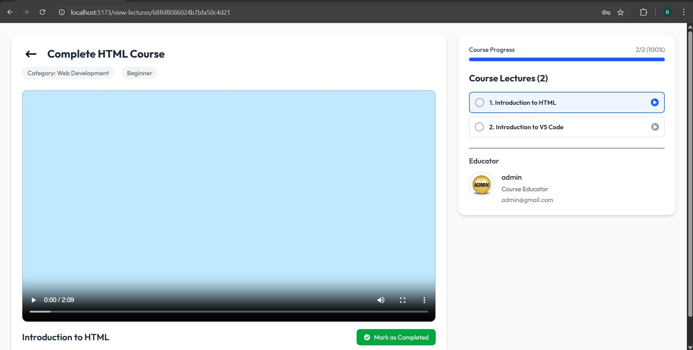
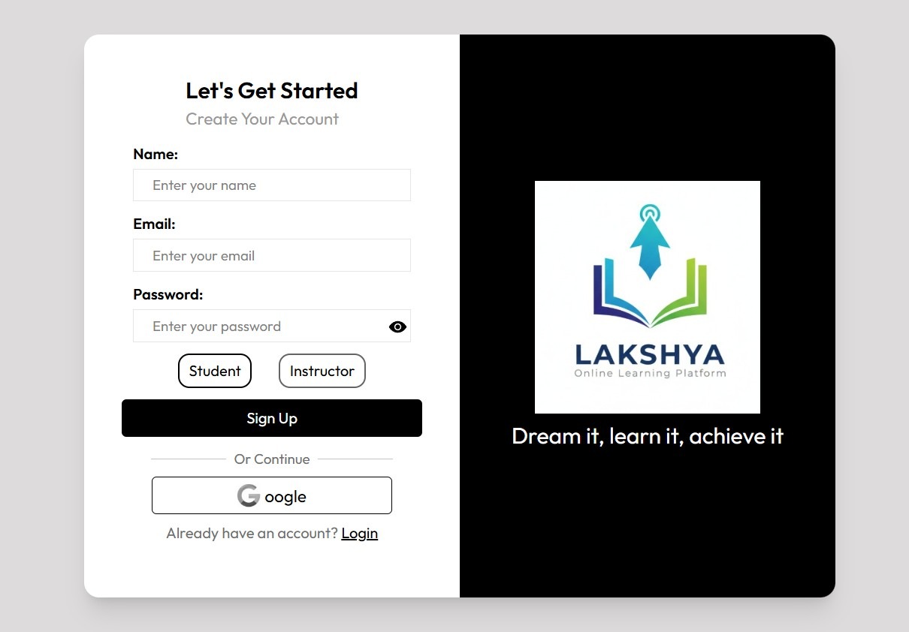
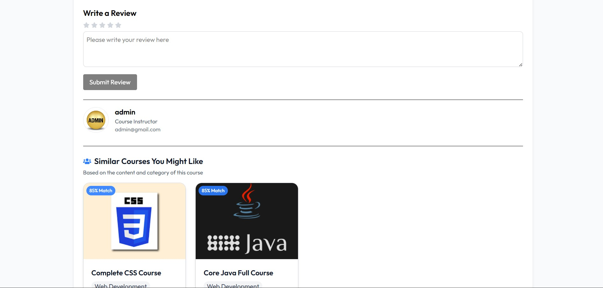

# 🎯 LAKSHYA – AI Integrated Learning Management System

LAKSHYA is a modern, AI-powered Learning Management System (LMS) built with the MERN stack (MongoDB, Express.js, React.js, Node.js). It delivers an intelligent, scalable, and interactive learning experience for students and instructors by integrating AI-driven features, secure authentication, and seamless payment processing.

---

## 🚀 Key Features

| Area | Feature |
|------|---------|
| 🤖 AI Integration | Gemini-powered smart search and course recommendations |
| 🔐 Authentication | Google OAuth for secure login/signup |
| 💳 Payments | PayPal integration for course purchases |
| 📊 State Management | Redux Toolkit |
| 👥 Dashboards | Student & Instructor dashboards |
| 📱 Responsive Design | Mobile + Tablet + Desktop |
| 🧩 Tech Stack | React, Tailwind, Node, Express, MongoDB |

---

## 📸 Application Preview

<div align="center">
  <table>
    <tr>
      <td><b>🏠 Home</b><br></td>
      <td><b>📚 Course</b><br></td>
    </tr>
    <tr>
      <td><b>🎬 Lecture</b><br></td>
      <td><b>🔐 Login</b><br></td>
    </tr>
    <tr>
      <td><b>💳 Payment</b><br></td>
      <td><b>⭐ Review</b><br></td>
    </tr>
  </table>
</div>

---

## ⚙️ Installation & Setup

### 1️⃣ Clone the Repository
```bash
git clone https://github.com/BibekYogi6462/lakshya-ai-lms.git
cd LAKSHYA-AI-LMS

2️⃣ Backend Setup
cd backend
npm install
npm start

3️⃣ Frontend Setup
cd frontend
npm install
npm start

🔑 Environment Variables

Create a .env file in backend/:

MONGO_URI=your_mongodb_connection_string
GOOGLE_CLIENT_ID=your_google_oauth_client_id
GOOGLE_CLIENT_SECRET=your_google_oauth_client_secret
RAZORPAY_KEY=your_razorpay_key_id
RAZORPAY_SECRET=your_razorpay_key_secret
GEMINI_API_KEY=your_google_gemini_api_key

Future Enhancements
📊 Advanced Analytics
🎯 Personalized Learning
📱 Mobile App
🎥 Live Classes
🧠 AI Tutor

🤝 Contributing
Fork the repository
Create a feature branch
Commit changes
Push to GitHub
Open Pull Request

📄 License
MIT License

📧 Contact

Bibek Yogi
🔗 https://github.com/BibekYogi6462
